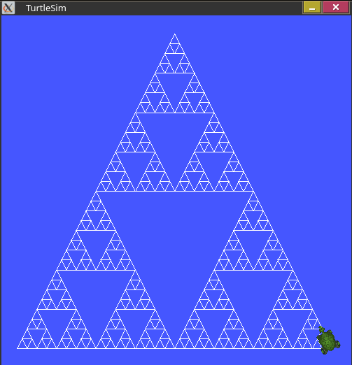
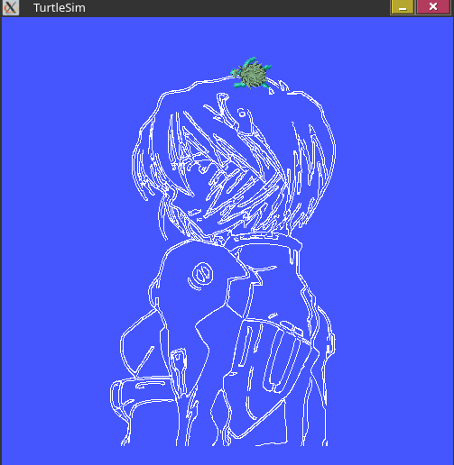
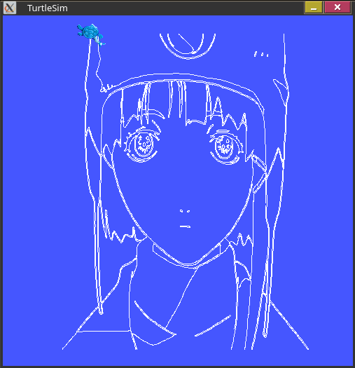

# rei_turtle

ROS 2 assignment submission where a ROS node instructs `turtlesim` to draw unique shapes.

The `turtlecontroller` node accepts draw requests via a service, converts an image (or a procedurally generated fractal) into contours, then drives `turtle1` with `set_pen` + `teleport_absolute` to trace them.

Services provided by `turtlecontroller`:

| Service         | Type                                             | Description                                                      |
| --------------- | ------------------------------------------------ | ---------------------------------------------------------------- |
| `turtle/draw`   | `cpp_pubsub/srv/DrawShape` (`string shape_name`) | Start drawing. `sierpinski` for fractal, or absolute image path. |
| `/turtle/pause` | `std_srvs/srv/Trigger`                           | Toggle pause/resume.                                             |
| `turtle/reset`  | `std_srvs/srv/Trigger`                           | Clear canvas, reset turtle to center.                            |

## Prerequisites

- ROS 2
- OpenCV
- C++23 compiler, CMake, colcon
- `glm` is vendored under `src/cpp_pubsub/vendor/glm`, no install needed

## Build

```bash
colcon build --packages-select cpp_pubsub
source install/setup.bash
```

## Run

In separate terminals (after sourcing):

```bash
ros2 run turtlesim turtlesim_node
ros2 run cpp_pubsub turtlecontrol
```

List services if names are namespaced:

## Usage

Draw Sierpinski triangle:

```bash
ros2 service call turtle/draw cpp_pubsub/srv/DrawShape "{shape_name: 'sierpinski'}"
```

Draw contours from an image:

```bash
ros2 service call turtle/draw cpp_pubsub/srv/DrawShape "{shape_name: 'imgs/rei.jpg'}"
```

Pause / resume:

```bash
ros2 service call /turtle/pause std_srvs/srv/Trigger
```

Reset canvas:

```bash
ros2 service call turtle/reset std_srvs/srv/Trigger
```

## Demo







## Project structure

```
src/cpp_pubsub/
  srv/DrawShape.srv            # shape_name
  src/turtlecontrol.cpp        # TurtleController node, services, draw loop
  src/graphics/shape.h/.cpp    # Shape interface + OpenCV + Sierpinski impls
  src/publisher.cpp            # minimal demo pub (unused)
  src/subscriber.cpp           # minimal demo sub (unused)
  vendor/glm/                  # vendored math lib
imgs/                          # input images + result screenshots
```
